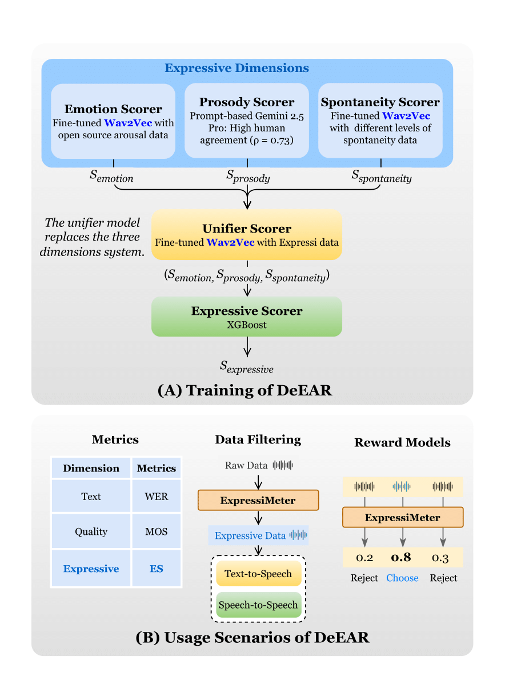

<div align="center">

# DeEAR

## Decoding the Ear: A Framework for Objectifying Expressiveness from Human Preference Through Efficient Alignment

</div>

<div align="center">
<h4>
  🤗 <a href="https://huggingface.co/datasets/FreedomIntelligence/ExpressiveSpeech" target="_blank">Dataset</a> | 🤗 <a href="https://huggingface.co/FreedomIntelligence/DeEAR_Base" target="_blank">Model</a> | 💻 <a href="https://github.com/FreedomIntelligence/ExpressiveSpeech" target="_blank">Code</a>
</h4>
</div>

## 📖 Introduction

Recent speech-to-speech (S2S) models can generate intelligible speech but often lack natural expressiveness, largely due to the absence of a reliable evaluation metric. To address this, we present **DeEAR (Decoding the Expressive Preference of eAR)**, a novel framework that converts human preferences for speech expressiveness into an objective score.

Grounded in phonetics and psychology, DeEAR evaluates speech across three core dimensions: **Emotion**, **Prosody**, and **Spontaneity**. It achieves strong alignment with human perception (Spearman's Rank Correlation Coefficient, SRCC = 0.86) using fewer than 500 annotated samples.

Beyond reliable scoring, DeEAR enables fair benchmarking and targeted data curation. We applied DeEAR to build **ExpressiveSpeech**, a high-quality dataset, and used it to fine-tune an S2S model, which improved its overall expressiveness score from 2.0 to 23.4 (on a 100-point scale).


## 🚀 Key Features

*   **Multi-dimensional Objective Scoring**: Decomposes speech expressiveness into quantifiable dimensions of Emotion, Prosody, and Spontaneity.
*   **Strong Alignment with Human Perception**: Achieves a Spearman's Rank Correlation (SRCC) of **0.86** with human ratings for overall expressiveness.
*   **Data-Efficient and Scalable**: Requires minimal annotated data, making it practical for deployment and scaling.
*   **Dual Applications**:
    1.  **Automated Model Benchmarking**: Ranks SOTA models with near-perfect correlation (SRCC = **0.96**) to human rankings.
    2.  **Evaluation-Driven Data Curation**: Efficiently filters and curates high-quality, expressive speech datasets.
*   **Release of ExpressiveSpeech Dataset**: A new large-scale, bilingual (English-Chinese) dataset containing ~14,000 utterances of highly expressive speech.


## 🔧 Framework Overview

The DeEAR framework follows a four-stage pipeline designed to decompose, model, and ultimately align the abstract concept of expressiveness with human preference.

<p align="center">
  
  <br>
  <em>Figure 1: The DeEAR Framework. (A) The training pipeline involves four stages: decomposition, sub-dimension modeling, learning a fusion function, and distillation. (B) Applications include data filtering and serving as a reward model.</em>
</p>

## ⚡ Quick Start

Follow the steps below to get started with the DeEAR.

### 1. Clone the Repository
```bash
git clone https://github.com/FreedomIntelligence/ExpressiveSpeech.git
cd ExpressiveSpeech
```

### 2. Setup
```bash
conda create -n DeEAR python=3.10
conda activate DeEAR
pip install -r requirements.txt
conda install -c conda-forge ffmpeg
```

### 3. Prepare
Download the DeEAR_Base model from [FreedomIntelligence/DeEAR_Base](https://huggingface.co/FreedomIntelligence/DeEAR_Base) and place it in the [models/DeEAR_Base/](./models/DeEAR_Base/) directory.

### 4. Inference
```bash
python inference.py \
    --model_dir ./models \
    --input_path /path/to/audio_folder \
    --output_file /path/to/save/my_scores.jsonl \
    --batch_size 64
```


## Supplementary Material

The [`Supplementary Material`](./Supplementary%20Material/) folder in this repository provides additional details for the experiments presented in our paper. This includes comprehensive information on the experimental setup and the data materials used.